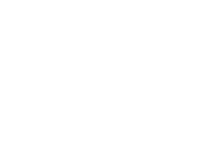
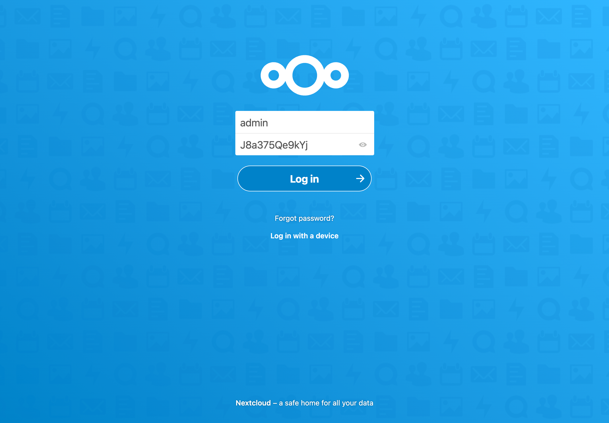

<div styles="background: #0082c9; width: 100%; height: 150px; display: flex; justify-content: center; align-items: center;">
    
</div>

<h1 align="center">Nextcloud</h1>

Lizz compatible application to add the [Nextcloud application](https://nextcloud.com/) to a Lizz managed Kubernetes cluster.

To learn more about Lizz, see the [documentation](https://openlizz.com).

## Requirements

To add the application, you first need to have a [Kubernetes cluster initialized with Lizz](https://openlizz.com/docs/guides/init).
You also need to have the [Lizz CLI installed](https://openlizz.com/docs/installation).

## Add the application

To add the application to your cluster, run the following:

```bash
lizz add github \
    --owner=$GITHUB_USER  \
    --fleet=fleet \
    --origin-url=https://github.com/openlizz/application-nextcloud \
    --path=./default \
    --destination=nextcloud \
    --personal
```

Check the [guide](https://openlizz.com/docs/guides/add) to understand how works the lizz add command.

> **Note**
> You can adapt the command depending on your use case. See the [command API](https://openlizz.com/docs/cli/lizz_add_github) for more information.

Reconcile the fleet repository to deploy the application using [Flux](https://fluxcd.io/):

```
flux reconcile source git flux-system
```

Check the pods with:

```
kubectl get pod -n nextcloud
```

The output should be similar to:

```
NAMESPACE       NAME                                        READY   STATUS    RESTARTS      AGE
nextcloud       nextcloud-7f8d8c4d4-cjbwb                   1/1     Running   1 (26s ago)   2m37s
```
    
## Usage

Access the application using port-forwarding or using the ingress created.
You should access the Nextcloud log in page, log in using the admin account and the admin password (the admin password is shown in the lizz add command output):



Once you are logged in, refer to the [Nextcloud user manuel](https://docs.nextcloud.com/server/latest/user_manual/en/contents.html) to learn how to use Nextcloud.

## Acknowledgements

This repository is only a wrapper to the [Helm chart](https://github.com/nextcloud/helm) of the [Nextcloud application](https://nextcloud.com/) to help its deployment in a Kubernetes cluster managed by Lizz.

Therefore, the credit goes to the developers and maintainers of the application and the chart.